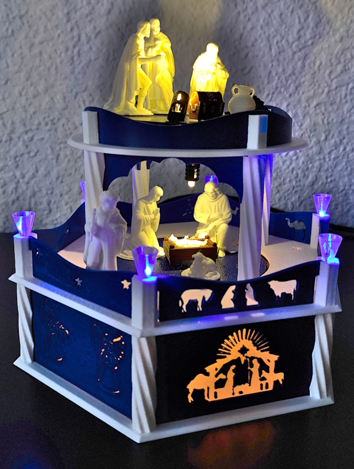

A 3D-printed, Motor-driven Christmas Pyramid
============================================

Introduction
------------

This project is about building a christmas pyramid with a motor driven
turntable, lightning and music. There are three distinct parts: the
electronics, the software and the 3D-design. A fourth part, a selfmade
pcb is available, but not necessary. I only use it because it
minimizes cables.

The electronics uses cheap parts that are widely available. The software is
implemented in CircuitPython and mostly portable. The 3D build uses
easy to print parts that can be assembled without glue.

Besides the "big" version with multiple levels, a simplified version is
also available:

The simplified version uses mainly the same electronics as the normal
version of the pyramid, but the 3D-build is much simpler.

Details
-------

Read about

  - [Electronics](./doc/electronics.md)
  - [Software](./doc/software.md)
  - [3D-Printing](./doc/printing.md)
  - [Support-PCB](./doc/pcb.md)
