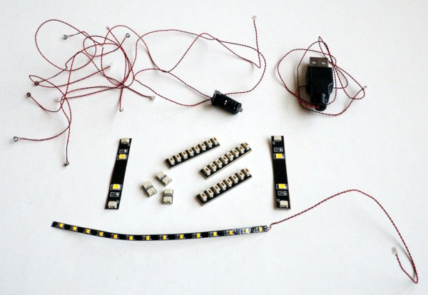

Electronics
===========

The Motor
---------

The turntable is driven by a small 28BYJ-48 stepper motor (5V
version). Stepper motors are actually not the first choice for
continuous rotation, but since we need very low rpm values, this
option simplfies things. Another advantage is the fact that we can
drive this motor with 5V, so we only need a single power supply for
the motor and the microcontroller board.

The motor needs a driver board. It is usually sold together with an
uln2003a board. Make sure to buy the "blue" version with all seven
pins broken out. The board has seven channels, four of them are
necessary for the motor. The remaining three channels can be used to
drive LEDs.

If you want to turn more than one level, you probably need a stronger
motor, e.g. a NEMA-17. Those motors also need a different voltage and
a different driver board. In this case it is better to supply the 5V
for the microcontroller from a step-down board.

The motor does not have to be in the center of the turntable but you
will need gears if not. OpenSCAD has a gears library that might be
useful in this case.

Lighting
--------

There are many options available to add some lighting. This implementation
uses three channels of the uln200a to drive 5V LEDs. Basic illumination
for the silhouettes uses standard 3mm LED-strips cut to the right length
(they can be cut and soldered every 25mm).

For the remaining lights, normal flicker-LEDs are a good choice. They are
available pre-assembled with resistor and cables. Another option are
components from a Lego lighting kit. The LEDs use very thin wires which
makes assembly easy. The drawback are the connectors they use. It
is not trivial to attach them to a normal devboard, and even
attaching them to standard (lego-lighting) components is fiddly.

The pyramid in this project makes heavy use of them to distribute
power to the upper levels through hallow posts.

Music
-----

The recommandation for music is to use a [DFPlayer
Mini](https://wiki.dfrobot.com/DFPlayer_Mini_SKU_DFR0299). This
breakout is not much larger than a SD-reader. It has a MP3-decoder and
an amplifier on board. The autonomous player takes load off the
microcontroller.  Two IOs enable basic operation (next/previous song
and volume up/down). All functions can be controlled using
UART-commands. Libraries for the DFPlayer are available for every
relevant language.

The alternative is to decode the MP3 in the microcontroller and output
I2S to a small I2S-DAC (e.g. the MAX98357A). While this does works it
has a number of drawbacks. At least with the ESP32-S2 which I use the
motor tends to stutter. A faster processor might not have this
problem. The second drawback is the larger number of pins needed (four
for the SD-card, four for the I2S-DAC and some more for buttons if you
want to control the playback). And finally a SD-breakout plus
amplifier is more expensive than the DFPlayer and both together need
two times the physical space.

The Microcontroller
-------------------

The mcu must provide enough digital IO pins and must be fast
enough. Something like the Pico should be fine. Depending on your
setup, you need

  - motor: 4 IO-pins
  - LEDs: 0-3 IO-pins
  - DFPlayer: 2 UART pins
  - Buttons: 3 IO pins

Since the DFPlayer provides two IOs, the IOs for the three buttons will
control the turntable speed (slower/faster) and pause the audio.
If you want to control more functions, you need more.

This project uses the Lolin-S2 Mini. It provides many pins on a small
footprint. As an added bonus, it could act as a webserver to enable
remote control via an app. This is an option that is not implemented.

Further Reading
---------------

Head on to [Software](./software.md) to read about the how to
drive the hardware.
