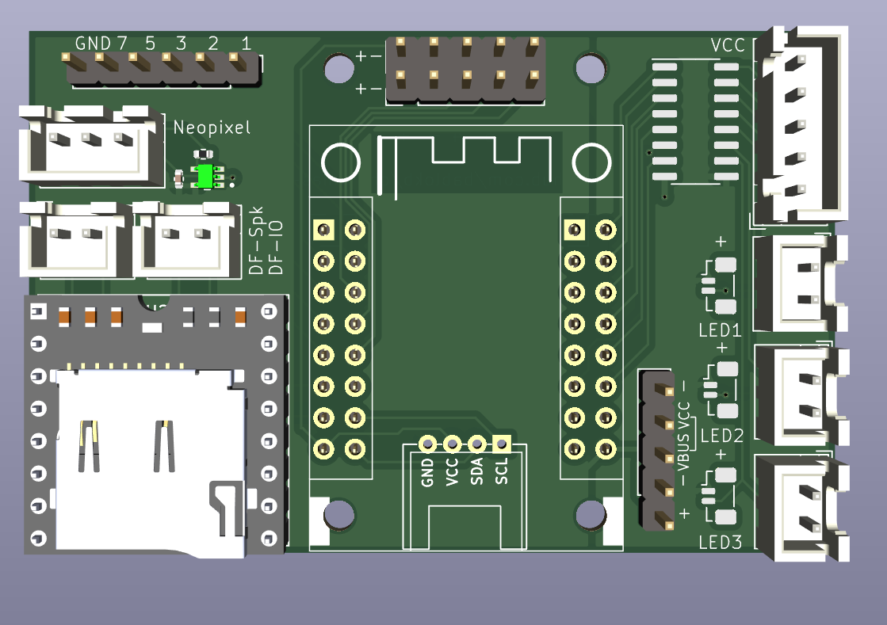

Support PCB for Electronic Components
=====================================

This PCB allows you to put all components on a small footprint.

On board:

  - uln2003a motor driver
  - level-shifter for a strand of neo-pixels
  - 3 SURS connectors for Lego-lighting

Connectors (THT):

  - Motor (JST-XH)
  - 3xLED (JST-XH)
  - Lolin S2-Mini
  - DFPlayer Mini
  - Speaker
  - 2 IOs from DFPlayer
  - 1x6 header with GND + 5 IOs (for external buttons)
  - 2x5 header with 2xGND, 2x3V3 + 6 IOs
  - 1x Grove I2C

This project neither uses the neo-pixel, the I2C-connector or the
optional 2x5 IO-header.

In the directory `production_files` you have ready to deploy files
for JLCPCB.

Schematic
---------

Layout
------

3D-View
-------

Note: there is no 3D-file for the SUR-Adapter, so this part
is missing in this image:

License
-------

[![CC BY-SA 4.0][cc-by-sa-shield]][cc-by-sa]

This work is licensed under a
[Creative Commons Attribution-ShareAlike 4.0 International
License][cc-by-sa].

[![CC BY-SA 4.0][cc-by-sa-image]][cc-by-sa]

[cc-by-sa]: http://creativecommons.org/licenses/by-sa/4.0/
[cc-by-sa-image]: https://licensebuttons.net/l/by-sa/4.0/88x31.png
[cc-by-sa-shield]:
https://img.shields.io/badge/License-CC%20BY--SA%204.0-lightgrey.svg
