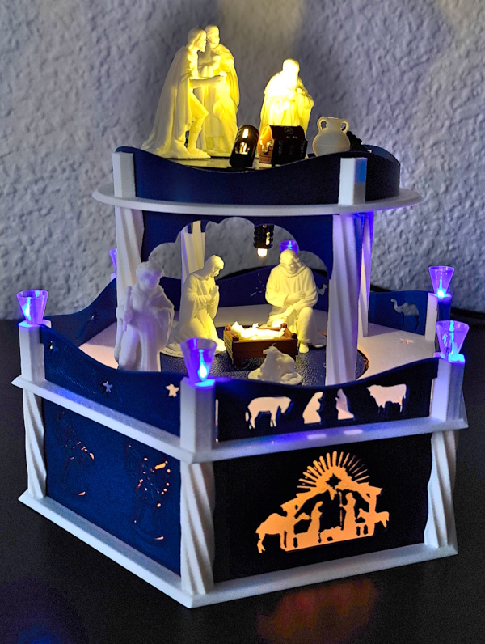
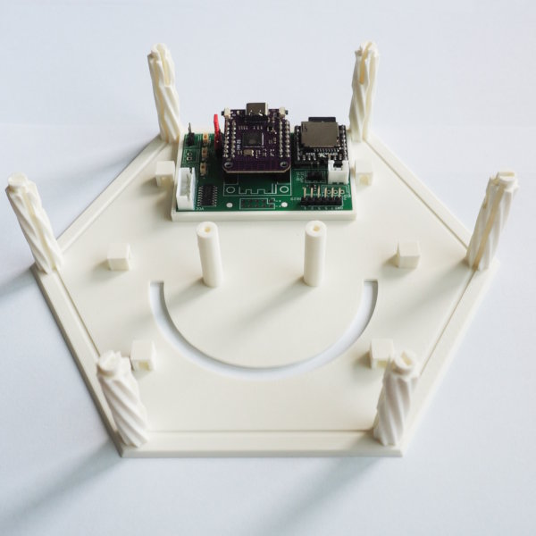
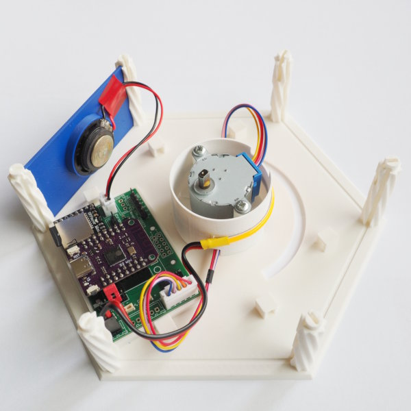
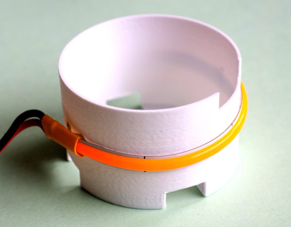
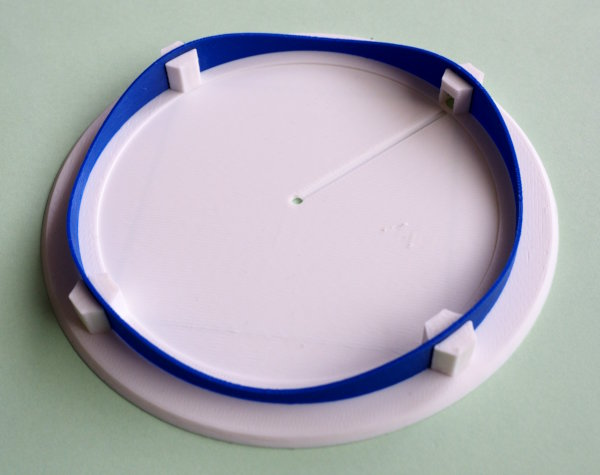
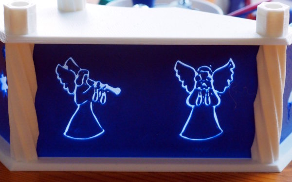
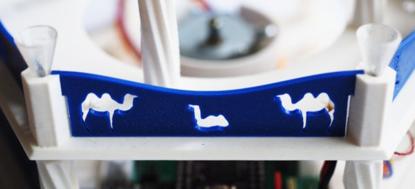
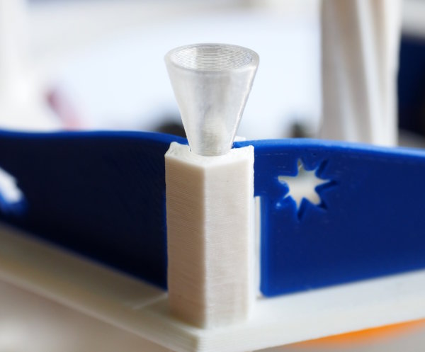
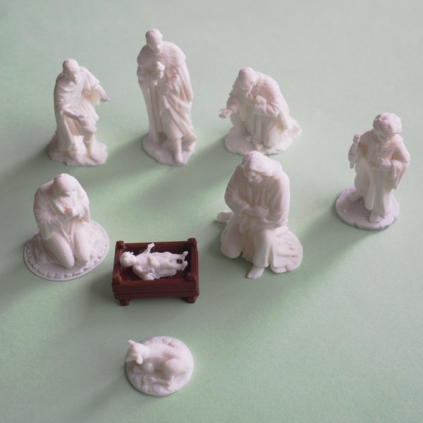

3D Design and Printing
======================

The pyramid itself was created using OpenSDAD. Some existing models were
reused, mainly for cutouts and silhouettes. You will find all links below.

Architecture
------------

The pyramid (currently) has a base and two additional levels.  The
base and the levels are printed as skeletons without
walls/fences. These are printed separately. This allows for different
colors, makes silhouettes possible and also helps during assembly.

The basic geometric form is a regular hexagon. The side of the hexagon
is the same as the outer-radius, this makes calculations easy. All
major dimensions are a function of this size. The pyramid in the picture
was printed with a size of 85mm. Most printers should handle sizes up to
100mm which gives a diameter of 200mm.

There is a file called [`3D/dimensions.scad`](../3D/dimensions.scad)
and a file called [`3D/shared.scad`](../3D/shared.scad).  Both define
dimensions for the print. The first one sets generic dimensions which
depend on your printer (e.g. `w4`: optimal width for a 4-perimeter
wall). The second file has all the application level sizes.

Depending on the electronic-parts you are using, you will most certainly
need to modify the base-level, the wall for the speaker and the
wall for the buttons/sd-card/USB-connector.

Filaments
---------

I used the following filaments:

  - BambuLab: Matte Ivory White (PLA)
  - Filament.de: Königsblau (PLA, royal blue)
  - Filament.de: Natur (PLA, transparent)
  - Filament.de: Weiß (PETG, white)

Other filaments will certainly also work well, but you might have to
tweak some settings to get dimensions right.

Printing Hints
--------------

Most parts of the pyramid were printed with PLA and a standard nozzle,
with a layer height of 0.2mm. There are a few exceptions though.

The led-strip holder was printed with PETG for higher thermal stability.
The round level2-fence was printed with a layer hight of 0.15mm, as were
the nativity figures.

For the silhouettes I printed the first three layers with transparent
PLA, the rest was printed in blue. You need to add a color change
in the slicer after the third layer.

Cutouts were printed as is. The challenge was to find suitable models
that don't have "islands" within the cutout.

The little lamp-shades on level1 were printed in vase-mode without top
and bottom, again using transparent PLA. Since version 2.9.2
Prusa-Slicer supports sequential printing, so I could print all
lamp-shades in one go. This greatly reduces the overhead time since
bed-leveling is only needed once.

The nativity figures were downscaled to 40% and printed with a layer
height of 0.15mm using tree supports (Prusa-Slicer calls this
"natural" supports). Removing the supports was not difficult, but you
need to take great care not to break anything. The only thing that did
not survive was the rod of the young shepard. But this is due to
downscaling, the rod is just too thin at 40%.

Models
------

This project uses a number of models from other authors. The nativity
figures were used as is (except downscaling). The other models were used
for the walls and fences for cutouts and silhouettes. They were
flattened (linear projection) and resized for this purpose. The remixes
are in the directory [3D/input](../3D/input/README.md).

All models used allow remixing. See the links for details. One model has been
deleted.

Nativity Figures by [Peter Farell](https://www.printables.com/@PeterFarell):

  - Mary: <https://www.printables.com/model/1064402-nativity-mary>
  - Joseph: <https://www.printables.com/model/1064354-nativity-joseph>
  - Baby Jesus and manger: <https://www.printables.com/model/1064779-nativity-swaddled-baby-jesus-and-manger-set>
  - Wisemen: <https://www.printables.com/model/1049972-nativity-magi-wise-men>
  - Young shephard: <https://www.printables.com/model/1065406-nativity-young-shepherd-boy>
  - Shephard: <https://www.printables.com/model/1064471-nativity-shepherd>
  - Sheep: <https://www.printables.com/model/1064503-nativity-sheep-set>

Base walls (`../3D/base_walls.scad`):

  - Nativity scene: <https://www.printables.com/model/1117975-nativity-set>
  - Comet star (star of Bethlehem): <https://www.thingiverse.com/thing:4691295>
  - Angels: <https://www.printables.com/model/7671-angel-ornaments-for-your-window>

Level1 fences: (`../3D/level1_fences.scad`)

  - Comet star (star of Bethlehem): <https://www.thingiverse.com/thing:4691295>
  - Christmas tree (with star): <https://www.printables.com/model/333927-christmastree>
  - Christmas tree (abstract): <https://www.printables.com/model/102859-christmas-tree>
  - Camel (deleted): <https://www.printables.com/model/1282015-camel-low-poly>
  - Camel sitting, Mary, Joseph, donkey, cow: <https://www.printables.com/model/667692-nativity-scene>

Further Reading
---------------

Head on to [Support PCB](./pcb.md) to read about the optional pcb used
to simplify wiring.
